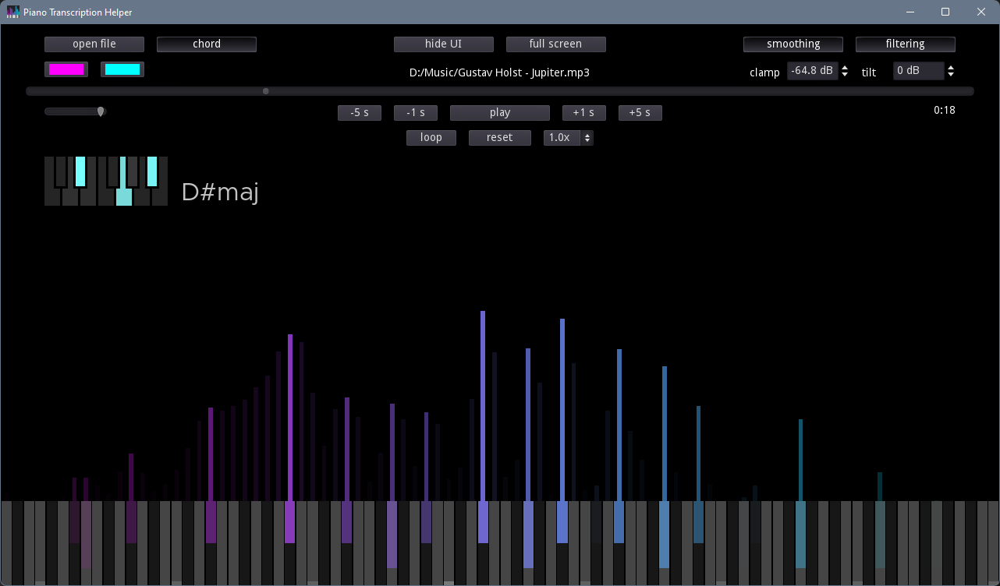

# Godot Piano Transcription Helper
Current version: 1.2

### Description
A tool to analyse music files by frequencies of every piano key, and analyse chords. Can also just be used as a cool background :)

mp3 and ogg files are supported.

Created on Godot 3.4

### Screenshot

### Version 1.2 Changes & Features:
- Chord analysis
- Currently opened file path is now displayed

### Version 1.1 Changes & Features:
- Updated icon
- Fixed bugs

### TODO and Ideas:
- ~~Fix bug: Mac OS version may not work~~ It kinda works now but some work is required on the user side
- Fix bug: Linux version may not work
- Make keys look more like actual piano keys
- Export as MIDI
- Export audio spectrogram

### DONE:
- Add keyboard shortcuts
- Make keys light up
- Add mode that make frequency peaks easier to see
- Give user control to displayed dB range
- Add temporal smoothing
- Make bars freeze in position when playback is paused
- Add option to hide UI and piano keys
- Add option to make lower frequency magnitudes smaller and higher frequency vice versa, so that it matches human perception better
- Fix bug: Some buttons aren't repositioned correctly when window is resized
- Make sudden fluctuations have more influence in smoothing mode
- Add lines to display current clamp and tilt value
- Add loop mode
- Fix bug: shortcut keys don't work when text fields are in focus
- Rearrange UI
- Add volume control and mute function
- Add full screen mode
- Add UI hints
- Add secret colour mode
- Make C keys easier to identify
- Fix bug: looping doesn't perform correctly on long tracks
- Make hide button reappear when UI is hidden
- Add track tempo scaling feature
- Release v1.0
- Fix bug: Hint on "hide" button isn't correct
- Fix bug: Unintentional behaviour occurs when H key is pressed
- Update logo so that it doesn't look too similar to the Synthesia logo
- Release v1.1
- Add chord analysis feature
- Add current file path display
